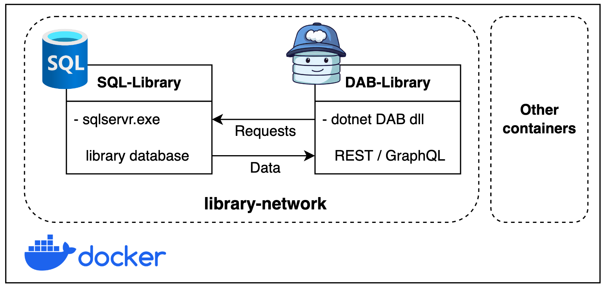
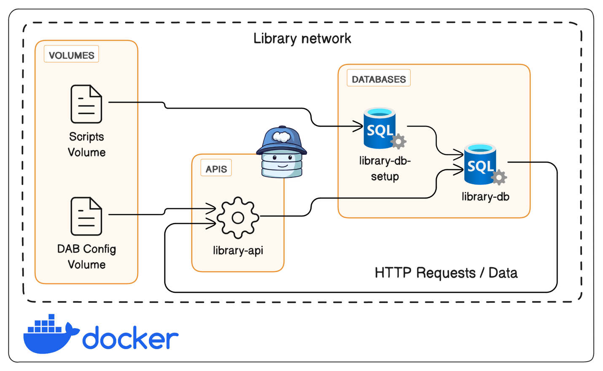

# Build your APIs with DAB using Containers

Are you tired of spending countless hours building APIs from scratch? With [Data API Builder (DAB)](https://learn.microsoft.com/azure/data-api-builder), you can create your API in just minutes! All you need to do is create a JSON configuration file to describe your database entities (tables, views, stored procedures, or collections) from your Azure SQL Database, SQL Server, Cosmos DB, PostgreSQL, or MySQL database. In this blog series, I will share a few examples of how to build your APIs with DAB using containers!

Using containers to build your APIs with DAB provides a consistent, isolated, portable, and lightweight local development experience that makes team collaboration easier.

Once the local development is completed, one possible next step is to deploy the same solution consistently to Azure services such as Azure Container Apps and Azure SQL Database.

## Getting Started

DAB, an open-source tool, simplifies the process of developing applications that require database interaction by automatically generating CRUD (Create, Read, Update, Delete) operations. It achieves this by reading entities directly from your database. It provides you with multiple ways to run the DAB Engine, offering flexibility to suit various preferences.

### Command Line Interface (CLI)

Providing a straightforward and efficient means of running the engine.

### DAB Source Code

Alternatively, for those who prefer more hands-on control, running the DAB Engine using the source code is an option, allowing customization and detailed configuration.

### Container

Lastly, if convenience is a priority, employing a container offers a portable and encapsulated environment, simplifying the deployment and management of the DAB Engine. With these options, users can choose the method that aligns best with their workflow and requirements.

**Let’s have a look at the first example of using DAB with containers.**

## Library Demo using Docker containers

The following diagram represents the container architecture for this demo:



The SQL-Library container manages data securely with Microsoft SQL Server 2022, while the DAB-Library container, powered by  Data API Builder, offers REST and GraphQL endpoints that will make requests to our database.

### Prerequisites

- Docker / Podman
- GitHub (optional)
- Visual Studio Code / Azure Data Studio (optional)  

> [!TIP]
> In case you want a minimal experience, and just get started quickly check the [bash-commands.sh](bash-commands.sh) included in this repository.

### Creating the container network

I will start this container exercise by creating Docker network. This virtual network will help the SQL Server container and DAB container talk to each other using the container hostname. It will also provide isolation and a private channel for our containers in this example.

```bash
docker network create library-network
```

### Build the SQL Server container

Many documentation articles and examples exist for creating a SQL Server container using Docker. You can check the latest version of SQLCmd (Go), which allows you to create a SQL Server container with a single command following this [Quickstart article](https://learn.microsoft.com/sql/tools/sqlcmd/quickstart-sqlcmd-create-container). Or, if you are not familiar with SQL Server containers check this other [Quickstart article](https://learn.microsoft.com/sql/tools/sqlcmd/quickstart-sqlcmd-create-container) that provides greater details.

```bash
# SQL Container
docker run \
    --hostname SQL-Library \
    --name SQL-Library \
    --env 'ACCEPT_EULA=Y' --env 'MSSQL_SA_PASSWORD=P@ssw0rd!' \
    --publish 1401:1433 \
    --network library-network \
    --detach mcr.microsoft.com/mssql/server:2022-latest
```

> [!NOTE]
> When running Docker on an ARM chip-based machine, ensure to include the --platform linux/amd64 option in your docker run command.

You can use your preferred tool to execute the SQL script to create the sample database. However, I recommend using Azure Data Studio. If you are unfamiliar with Azure Data Studio, you can learn more you can learn more in Azure Data Studio here: [aka.ms/azuredatastudio](https://aka.ms/azuredatastudio).

Connect to your SQL Server container using localhost as server name, 1401 as port, and SA user and password. Then, execute the [library.azure-sql.sql](Scripts/library.azure-sql.sql) file included in this repository to create the library database and all its objects.

### Build the DAB container

Now that our Library database is ready, it is time to start working on the API side using DAB. The DAB container image requires only one parameter the JSON configuration file where you need to define the connection string and the database entities.

Because we are working in this containerized environment, you don’t need to go through the usual DAB workflow (dab init, dab add, dab start). Once the container is started through the docker run command, the DAB engine will be listening on the defined port.

#### Utilizing Environment Variables in DAB with Containers

Starting from DAB v0.8.49, you can use environment variables to store sensitive data, for example a database connection string. These environment variables cat be set directly in the system or creating an .env file containing a list of different variables (key-value pairs). For more information check this previous blog post: Data API Builder Now Supports ENV Files.

This repository uses the following folder structure to store DAB’s configuration files:

```bash
├── DAB-Config
    ├── .env
    └── dab-config.json
```

With the flexibility that Docker provides in leveraging environment variables, I will be utilizing the `.env` file in this repository to securely store sensitive information such as my database connection string. By defining the necessary variables in the .env file, like the example below:

```bash
CONN_STRING=Server=SQL-Library;Database=library;User ID=SA;Password=P@ssw0rd!;TrustServerCertificate=true
```

The data source section of the JSON configuration file is where you define the database type and connection string. Notice how this configuration file dynamically incorporates the securely stored connection string by referencing the `CONN_STRING` environment variable using the `@env( )` syntax:

```
  "$schema": "https://github.com/Azure/data-api-builder/releases/download/v0.9.7/dab.draft.schema.json",
  "data-source": {
    "database-type": "mssql",
    "connection-string": "@env('CONN_STRING')"
  },
  "mssql": {
    "set-session-context": true
  }
```

#### Runtime and Entity Configurations

The runtime section encompasses configurations for operational aspects. Defining settings for REST and GraphQL endpoints like host mode and authentication providers. In the entities section, data entities like **Author** and **Book** tables are defined with specific configurations and permissions.

This last section enables seamless integration and exposure to your data entities via Data API Builder, aligning with your application requirements.

#### Setting up the DAB-Library Container

The following docker run command establishes a container named DAB-Library using the latest version of Microsoft's Data API Builder:

```bash
# DAB Container
docker run \
    --name DAB-Library \
    --volume "./DAB-Config:/App/configs" \
    --publish 5001:5000 \
    --env-file "./DAB-Config/.env" \
    --network library-network \
    --detach mcr.microsoft.com/azure-databases/data-api-builder:latest \
    --ConfigFileName /App/configs/dab-config.json
```

> [!NOTE]
> When running Docker on an ARM chip-based machine, ensure to include the --platform linux/amd64 option in your docker run command.

This container leverages Docker’s functionality to mount the local folder `./DAB-Config` as a volume inside the container at `/App/configs`. This is the default path used by DAB’s engine to read the configuration file, that will be pass to this container in runtime. The host port 5001 is mapped to container port 5000 for external access while connecting it to the previously created network library-network.

The environment file flag points to the environment file at `./DAB-Config/.env`, managing sensitive information in this case SQL Server’s connection string. Networking is handled by `--network library-network`, connecting the container to the specified network.

Finally, it runs the container in the background using Data API Builder’s latest container image while setting the configuration file.

## Library Demo using Docker Compose

The following diagram represents the container architecture for this demo:



This containerized application using Docker Compose consists of three main components: Volumes, APIs, and databases. The volume, store data or files needed by the application. Such as SQL scripts and the configuration file for DAB. The API layer handles HTTP requests (REST / GraphQL) and data operations inside this network, using Data API Builder. The database stores and manages the library data, using Microsoft SQL Server.

### Prerequisites

- Docker / Podman
- GitHub (optional)
- Visual Studio Code / Azure Data Studio (optional)  

> [!TIP]
> In case you want a minimal experience, and just get started quickly check the [bash-commands.sh](bash-commands.sh) included in this repository.

### Creating the Docker Compose file

We deploy all these components as Docker containers, defining and configuring them as services using a Docker compose file as follows:

```bash
version: '3.8'

services:
  library-db:
    image: mcr.microsoft.com/mssql/server:2022-latest
    hostname: SQL-Library
    container_name: SQL-Library
    environment:
      ACCEPT_EULA: Y
      SA_PASSWORD: ${SA_PASSWORD}
    ports:
      - "1401:1433"
    networks:
      - library-network
    restart: unless-stopped
    healthcheck:
      test: ["CMD-SHELL", "/opt/mssql-tools/bin/sqlcmd -S localhost -U sa -P ${SA_PASSWORD} -Q 'SELECT 1' || exit 1"]
      interval: 10s
      retries: 10
      start_period: 10s
      timeout: 3s

  library-db-setup:
    image: sqlcmd-go-scratch
    hostname: SQL-Config
    container_name: SQL-Config
    volumes:
      - ./Scripts:/docker-entrypoint-initdb.d
    networks:
      - library-network
    depends_on:
      library-db:
        condition: service_healthy
    command: sqlcmd -S SQL-Library -U sa -P ${SA_PASSWORD} -d master -i docker-entrypoint-initdb.d/library.azure-sql.sql -e -r1

  library-api:
    image: mcr.microsoft.com/azure-databases/data-api-builder:latest
    container_name: DAB-Library
    volumes:
      - "./DAB-Config:/App/configs"
    ports:
      - "5001:5000"
    env_file:
      - "./DAB-Config/.env"
    networks:
      - library-network
    depends_on:
      - library-db-setup
    command: ["--ConfigFileName", "/App/configs/dab-config.json"]
    restart: unless-stopped

networks:
  library-network:
    driver: bridge
```

> [!TIP]
> When running Docker on an ARM chip-based machine, ensure to include the `platform: linux/amd64` option in your docker compose file.


Let's dive deep on each individual service.

### library-db

This service creates the SQL-Library container using Microsoft SQL Server 2022's latest container image for Ubuntu 20.04. The ${SA_PASSWORD} variable in the environment section of the service configuration represents an environment variable that dynamically populates at runtime. When executing the docker compose up command with the SA_PASSWORD=<value> argument, this variable directly assigns the specified value passed through the command.

In this context, ${SA_PASSWORD} serves as a placeholder, allowing flexibility in setting sensitive information such as the SQL Server's System Administrator (SA) password without directly exposing it in the Docker Compose file. This practice enhances security by separating sensitive credentials from the configuration, ensuring they're securely provided during container initialization.

To enable connectivity, we configure this service to map port 1401 on the host to port 1433 within the container, facilitating external access. This mapping redirects requests arriving at port 1401 to port 1433 within the container, where the SQL Server instance listens for connections. Furthermore, the service integrates into the Docker Compose network named library-network, ensuring seamless communication with other services within the same network.

Finally, the health check configuration ensures continuous health and, more importantly, availability of this service. In this specific configuration, the health check involves executing a SQL query against the SQL Server instance running within the container. The query, SELECT 1, is a lightweight operation intended to verify that the database server is up and running and capable of processing queries. It employs the sqlcmd utility to connect to the local SQL Server instance using the SA credentials, dynamically provided through the ${SA_PASSWORD} environment variable. If the command fails to execute successfully, indicating a failure to connect to or query the database, the health check will fail.

### library-db-setup

This service was designed to efficiently execute SQL scripts for database initialization, without the need for a full SQL Server instance within a container. To accomplish this goal, I created a custom container image named sqlcmd-go-scratch. Unlike traditional SQL Server images, which include the complete database engine and additional features, this custom image is streamlined to include only the sqlcmd utility. By leveraging this minimalist container image with Scratch as the base OS, we omit unnecessary components, optimizing resource usage and simplifying the container's footprint.

> [!NOTE]
> You can learn more about the sqlcmd-go-scratch custom image on this [GitHub repository](https://github.com/croblesm/sqlcmd-go-scratch).

This service's command is responsible for initializing the library database. It accomplishes this by establishing a link between the local ./Scripts folder and a specific directory within the container called the entry point. Through this setup, sqlcmd can connect to the SQL-Library container using the provided connection parameters. Additionally, upon startup, it seamlessly accesses and executes the SQL script file located at docker-entrypoint-initdb.d/library.azure-sql.sql.

The service depends on the library-db service, which is the main database service for the library-network. It uses the condition: service_healthy option to specify that it should only start after the library-db service passes its health check test.

> [!NOTE]
> The -e and -r1 options enable the echo and error reporting features of the sqlcmd tool. To learn more about sqlcmd command-line options check [the documentation](https://learn.microsoft.com/sql/tools/sqlcmd/sqlcmd-utility#command-line-options).

The library-db-setup service runs the command only once, and then exits. It does not need to be restarted or kept running, as its only purpose is to initialize the library database.

### library-api

The library-api service plays a pivotal role in providing access to the library's API layer functionalities via HTTP requests through REST or GraphQL endpoints. It leverages the latest Data API builder (DAB) container image, which requires you to configure the DAB engine using a configuration file to set the database connection string and API entities. For that matter, this service uses both the DAB configuration and env files located within the ./DAB-Config directory. By mounting this directory as a volume, the DAB engine running within the container can seamlessly access the necessary configuration.

Furthermore, we establish a clear dependency with the library-db-setup service to ensure the database is fully initialized before the API service starts. As explained before, this other service is responsible for setting up the database schema and seeding initial data, ensuring that the API service operates on a fully functional database environment when the DAB engine starts.

In terms of connectivity, this service exposes port 5000 within the container, which is the default port for the DAB. However, to enable external access, the service maps this port to port 5001 on the host machine. This configuration allows users to access the library's API REST and GraphQL endpoints conveniently through localhost:5001.

Overall, the library-api service encapsulates the essential components required to provide a robust and accessible API interface for interacting with the library's database within the Docker Compose architecture.  

Now that we understand the basics of each service defined in the Docker compose file in the Library demo architecture. Let’s initiate all the services using `docker compose`:

```bash
SA_PASSWORD=P@ssw0rd! docker compose up -d
```

This command initiates the deployment of Docker containers according to the specifications outlined in the docker-compose.yml file. By setting the SA_PASSWORD environment variable to P@ssw0rd!, it configures the password for the SQL Server instance within the containers.

## Testing REST and GraphQL endpoints

To ensure the smooth functionality of your Data API Builder (DAB) container, a series of tests can be conducted once the container is up and running on your localhost. You can initiate a health check using the following command:

```bash
curl -v http://localhost:5001
```

For testing the DAB runtime REST endpoints, consider using the following commands to retrieve information about Book and Author entities:

```bash
curl -s http://localhost:5001/api/Book | jq
curl -s http://localhost:5001/api/Author | jq
```

Additionally, you can leverage the power of jq to filter and display specific data. For example:

```bash
curl -s http://localhost:5001/api/Book?$first=2 | jq '.value[] | {id, title}'
curl -s http://localhost:5001/api/Author | jq '.value[1] | {id, first_name, last_name}'
```

When working with GraphQL, you can use tools like `curl` or browser based GraphQL playgrounds. For example, using `curl`:

```bash
curl -X POST \ 
    -H "Content-Type: application/json" \ 
    -d '{"query": "{ books(first: 2, orderBy: {id: ASC}) { items { id title } } }"}' \ 
    http://localhost:5001/graphql | jq
```

> [!TIP]
> In case you want a minimal experience, and just get started quickly check the [bash-commands.sh](bash-commands.sh) included in this repository.

And this is how you can build your APIs with DAB using containers in just a few minutes!

## Resources
dditional resources or related projects

- [Data API Builder](https://aka.ms/dab)
- [Data API builder: AdventureWorks LT](https://github.com/Azure-Samples/dab-adventureworks-lt)
- [Jamstack Todo App with Azure Static Web Apps, Data API builder and Azure SQL Database](https://github.com/Azure-Samples/dab-swa-todo)
- [Library Demo](https://github.com/Azure-Samples/dab-swa-library-demo)